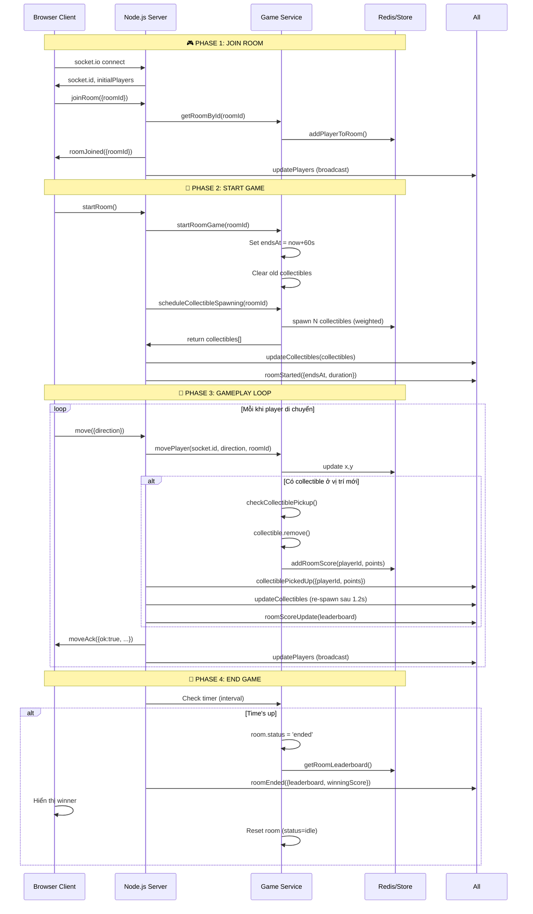
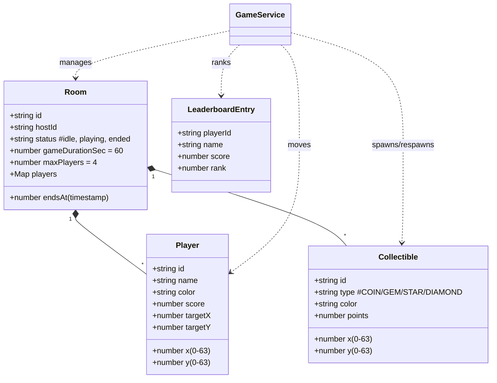

# Luồng của một ván game 64x64

```mermaid
flowchart TD
    Start[Khởi động server] --> Port[Port 5003]
    Port --> Static[Serving static files]
    Static --> Waiting[🟢 Chờ người chơi kết nối]

    Waiting --> CreateRoom[Tạo phòng\n(Tạo Room + Redis)]
    CreateRoom --> JoinRoom[Các người chơi khác tham gia]
    JoinRoom --> Ready[🟡 Sẵn sàng]

    Ready --> StartBtn[Nhấn &quot;Bắt đầu game&quot;]
    StartBtn --> InitGame[game.startRoomGame<br/>- Đánh dấu status=playing<br/>- Set endsAt = now + 60s<br/>- Clear old collectibles]
    InitGame --> Spawn[spawnCollectibles<br/>Random 25-35 items<br/>với weighted rarity]
    Spawn --> Broadcast[Broadcast collectibles<br/>to tất cả players]

    Broadcast --> GameLoop{⏱️ Vòng lặp 60s<br/>Game Loop}

    GameLoop --> Move1[👤 Player di chuyển<br/>→ Gửi socket 'move']
    Move1 --> Server1[SERVER:<br/>validate vị trí<br/>save player]
    Server1 --> CheckSpawn[Kiểm tra collectible ở vị trí mới]
    CheckSpawn -->|Có collectible| Pickup[collect checkCollectiblePickup<br/>→ Xóa collectible<br/>→ Cộng điểm]
    Pickup --> ScoreUpdate[update leaderboard<br/>→ emit 'roomScoreUpdate']
    ScoreUpdate --> Respawn[scheduleCollectibleRespawn<br/>→ Sau 1.2s spawn lại]
    CheckSpawn -->|Không có| Move1
    Respawn --> SpawnNew[spawn mới<br/>(weighted random)]
    SpawnNew --> BroadcastNew[Broadcast list mới]

    GameLoop --> |Mỗi 100ms| UI[Client render<br/>drawCollectibles<br/>drawPlayers<br/>showLeaderboard]
    UI --> GameLoop

    GameLoop --> TimerCheck{⏰ Đếm ngược<br/>endsAt đến?}
    TimerCheck -->|Chưa| GameLoop
    TimerCheck -->|Có| EndGame[Kết thúc game]

    EndGame --> CalcWinner[Tính winner<br/>- Sort leaderboard<br/>- Lấy rank #1]
    CalcWinner --> BroadcastEnd[Broadcast roomEnded<br/>→ { leaderboard, winningScore, winners }]
    BroadcastEnd --> DisplayWinner[HIỂN THỊ WINNER<br/>🎉 Người thắng!]
    DisplayEnd --> RoomReset[Reset room<br/>status=idle<br/>clear collectibles]
    RoomReset --> Waiting

    style Start fill:#e1f5e1
    style EndGame fill:#fce4ec
    style Pickup fill:#fff3e0,stroke:#ff9800
    style CalcWinner fill:#f3e5f5,stroke:#9c27b0
```

---

## 📋 Timeline chi tiết

| Thời điểm | Sự kiện | Ghi chú |
|-----------|---------|---------|
| T=0s | Server khởi động | Port 5003, Redis disabled |
| T=5s | Player 1 vào game.html | Truy cập http://localhost:5003/game.html |
| T=6s | Tạo Room | `game.createRoom()` → Room `mpkYf` |
| T=7s | Player 2-5 join | Cùng room code `mpkYf` |
| T=10s | Host nhấn "Bắt đầu" | → Emit `startRoom` |
| T=10.1s | Game khởi tạo | `startRoomGame()` set endsAt = T+60s |
| T=10.2s | Spawn collectibles | 25-35 items random (weighted) |
| T=10.3s | Broadcast | Tất cả client nhận list collectibles |
| T=10.4s → T=70s | **GAME PLAYING** | |
| T=12s | Player A di chuyển | → Nhận +2 điểm (thu thập GEM) |
| T=15s | Player B di chuyển | → Nhận +1 điểm (thu thập COIN) |
| T=20s | Player A di chuyển | Không có collectible → 0 điểm |
| T=25s | Player C thu thập STAR | → +3 điểm |
| T=30s | ... | Collectibles liên tục respawn sau 1.2s |
| T=70s | **GAME OVER** | Timer hết, broadcast kết quả |
| T=70.1s | Hiển thị winner | Leaderboard final, người cao nhất thắng |
| T=71s | Room về trạng thái idle | Có thể bắt đầu ván mới |

---

## 🔄 Luồng socket events



---

## 🎯 Scoring system

```mermaid
graph LR
    A[Player di chuyển<br/>đến cell có collectible] --> B{checkCollectiblePickup<br/>(x,y,playerId,roomId)}
    B --> C[Collectible tìm thấy?]
    C -->|Có| D[Xóa collectible khỏi map<br/>collectibles.filter()]
    D --> E[addRoomScore(playerId, collectible.points)]
    E --> F[Emit events:<br/>- collectiblePickedUp<br/>- updateCollectibles<br/>- roomScoreUpdate]
    C -->|Không| G[Không làm gì]
    F --> H[Collectible sẽ spawn lại<br/>sau 1.2s (scheduleRespawn)]
    H --> I[Spawn mới với weighted random<br/>COIN(50%)/GEM(30%)/STAR(15%)/DIAMOND(5%)]
```

---

## 🎨 Client rendering pipeline

```mermaid
flowchart TB
    Canvas[Canvas 640x640<br/>64x64 cells * 10px]
    
    subgraph RenderLoop [requestAnimationFrame]
        direction LR
        A[renderFrame()] --> B[clearRect]
        B --> C[drawGrid]
        C --> D[drawCollectibles]
        D --> E[drawPlayers]
        E --> F[updateUI<br/>status/timer/leaderboard]
    end
    
    subgraph Collectibles [drawCollectibles]
        direction LR
        C1[collectibles[]] --> C2[For each c]
        C2 --> C3{Switch c.type}
        C3 -->|COIN| C4[Draw gold circle]
        C3 -->|GEM| C5[Draw green diamond]
        C3 -->|STAR| C6[Draw red star]
        C3 -->|DIAMOND| C7[Draw cyan diamond]
        C4 & C5 & C6 & C7 --> C8[ctx.fill]
    end
    
    subgraph Players [drawPlayersFrame]
        direction LR
        P1[playersById Map] --> P2[For each player]
        P2 --> P3[Interpolate position<br/>lerp]
        P3 --> P4[Draw colored square]
        P4 --> P5[Draw name tag]
    end
    
    Canvas --> RenderLoop
    RenderLoop --> Collectibles
    RenderLoop --> Players
```

---

## 📊 Data structures



---

**Server đang chạy:** `http://localhost:5003`  
**Thời gian mỗi ván:** 60 giây  
**Điểm:** Chỉ từ collectible (không có điểm di chuyển)  
**Collectibles:** COIN(1pt), GEM(2pt), STAR(3pt), DIAMOND(5pt)
